# 🛡️ VisionSentry: Advanced AI Surveillance with SOTA Anomaly Detection and Multimodal Retrieval

> **Research-Grade Intelligent Multi-Stream Surveillance Pipeline featuring Feature-MAME Anomaly Detection, STOA Binding Gating, Set-of-Mark VLM Prompting, and CLIP-Enhanced Multimodal RAG.**

VisionSentry is a cutting-edge surveillance system that integrates state-of-the-art computer vision, anomaly detection, and multimodal AI technologies. This research implementation demonstrates advanced techniques for real-time event detection, semantic description, and intelligent retrieval in security footage.

---

## Complete Pipeline Architecture

The pipeline processes RTSP streams through a sophisticated **STOA Binding** architecture with real-time AI inference:

```mermaid
graph TD
    subgraph "Input"
        RTSP["RTSP Sources<br/>(Multi-Stream)"]
    end
    
    subgraph "DeepStream Processing"
        MUX["nvstreammux<br/>(Batch Muxing)"]
        YOLO["nvinfer<br/>(YOLOv11 Detector)"]
        MAME["nvinfer<br/>(Feature-MAME<br/>MobileNetV2)"]
        STOA["STOA Engine<br/>(Spatio-Temporal<br/>Object Attention)"]
        VLM["nvinferserver<br/>(TensorRT-LLM<br/>gRPC Backend<br/>Set-of-Mark Prompting)"]
    end
    
    subgraph "Video Processing"
        CONV["nvvideoconvert<br/>(GPU Conversion)"]
        OSD["nvdsosd<br/>(Draw Overlays)"]
        DEMUX["nvstreamdemux<br/>(Stream Separation)"]
    end
    
    subgraph "Output & Storage"
        SAVE["Frame Sinks<br/>(JPEG Encoding)"]
        CLIP["CLIP Encoder<br/>(Image + Text Embeddings)"]
        DB["Qdrant Vector DB<br/>(Multimodal Search)"]
    end
    
    subgraph "User Interface"
        RAG["Multimodal RAG Retrieval TUI<br/>(Text-to-Image Search)"]
    end
    
    RTSP --> MUX
    MUX --> YOLO
    YOLO --> MAME
    MAME --> STOA
    STOA --> VLM
    VLM --> CONV
    CONV --> OSD
    OSD --> DEMUX
    DEMUX --> SAVE
    SAVE --> CLIP
    CLIP --> DB
    DB --> RAG
    
    style RTSP fill:#e1f5ff,stroke:#01579b,stroke-width:2px,color:#000
    style MUX fill:#fff3e0,stroke:#e65100,stroke-width:2px,color:#000
    style YOLO fill:#f3e5f5,stroke:#4a148c,stroke-width:2px,color:#000
    style MAME fill:#f3e5f5,stroke:#4a148c,stroke-width:2px,color:#000
    style STOA fill:#e8f5e9,stroke:#1b5e20,stroke-width:2px,color:#000
    style VLM fill:#e8f5e9,stroke:#1b5e20,stroke-width:2px,color:#000
    style CONV fill:#fff9c4,stroke:#f57f17,stroke-width:2px,color:#000
    style OSD fill:#fff9c4,stroke:#f57f17,stroke-width:2px,color:#000
    style DEMUX fill:#fff9c4,stroke:#f57f17,stroke-width:2px,color:#000
    style SAVE fill:#fce4ec,stroke:#880e4f,stroke-width:2px,color:#000
    style CLIP fill:#fce4ec,stroke:#880e4f,stroke-width:2px,color:#000
    style DB fill:#fce4ec,stroke:#880e4f,stroke-width:2px,color:#000
    style RAG fill:#c8e6c9,stroke:#1b5e20,stroke-width:2px,color:#000
```



### Pipeline Flow Details

| Stage | Component | Purpose | GPU/CPU |
|-------|-----------|---------|---------|
| **1. Ingestion** | `nvstreammux` | Batch multiple RTSP streams | GPU (NVMM) |
| **2. Detection** | `nvinfer` (YOLOv11) | Person/object detection | GPU (TensorRT) |
| **3. Anomaly** | `nvinfer` (Feature-MAME) | Feature-space anomaly detection with Cosine Similarity | GPU (TensorRT) |
| **4. Gating** | STOA Engine | Deterministic spatio-temporal object attention gating | GPU/CPU |
| **5. Semantic** | `nvinferserver` (TensorRT-LLM) | Set-of-Mark visual prompting with Qwen2-VL | GPU (gRPC) |
| **6. Visualization** | `nvvideoconvert` + `nvdsosd` | Draw boxes, centroids & interaction points | GPU (CUDA) |
| **7. Demux** | `nvstreamdemux` | Split streams for per-stream sinks | GPU (NVMM) |
| **8. Storage** | `nvjpegenc` + `multifilesink` | Save frames as JPEG files | GPU (NVENC) |
| **9. Embedding** | CLIP Encoder | Generate multimodal embeddings | GPU/CPU |
| **10. Indexing** | Qdrant DB | Index visual and text embeddings | CPU |

---

## Key Features

1. **STOA Binding Gating Strategy**:
   - **Temporal Delta Filter**: Subtracts past heatmap from current to isolate new physical changes ($\Delta H = \max(H_t - H_{t-10}, 0)$)
   - **Box-Edge Prior**: Measures distance to bounding box edges with Plateau Gaussian Prior using dynamic sigma (35% of box height)
   - **Area Normalization & Weighted Centroid**: Hadamard product of delta heatmap and box-edge prior, normalized by area, yielding precise $(x, y)$ interaction coordinates

2. **Advanced Anomaly Detection with Feature-MAME**:
   - **Feature-Space Encoding**: Utilizes frozen MobileNetV2 backbone for robust feature extraction
   - **Cosine Similarity Metric**: Eliminates false positives from lighting/shadows by measuring latent space similarity instead of MSE
   - **Single-Video Online Training**: Micro-trains memory matrix on first 150 frames per stream for environment-specific adaptation, eliminating domain shift

3. **Set-of-Mark Visual Prompting for VLM**:
   - **Union Crop**: Encompasses YOLO person box and weighted centroid interaction point to preserve context
   - **Red Circle Annotation**: Draws highly visible red circle at exact $(x, y)$ interaction coordinate
   - **Precise Prompting**: "A structural anomaly occurred at the red circle. What object is involved?"

4. **CLIP-Enhanced Multimodal RAG Search**:
   - **Dual Embedding Storage**: Stores both CLIP image embeddings from cropped frames and text embeddings from VLM descriptions in Qdrant
   - **Zero-Shot Text-to-Image Retrieval**: Enables queries like "person holding a wrench" using CLIP's joint text-image embedding space
   - **Flawless Multimodal Matching**: Mathematically matches user queries directly to visual content for superior retrieval accuracy

5. **Real-Time Semantic Description**:
   - **Qwen2-VL** integrated via TensorRT-LLM backend
   - Communicates over gRPC port 8001 for low-latency inference
   - Generates natural language descriptions enhanced by visual prompting

---

## Technical Architecture Details

### 1. Feature-MAME Anomaly Detection

**Mathematical Formulation:**
- **Feature Extraction**: $f = \phi(I; \theta_{MobileNetV2})$ where $\phi$ is frozen MobileNetV2 backbone
- **Memory Matrix Construction**: $M = \{f_1, f_2, \dots, f_{150}\}$ from first 150 frames
- **Anomaly Scoring**: $s = 1 - \cos(f_t, M)$ where cosine similarity measures latent space deviation
- **Thresholding**: Anomaly if $s > \tau$ (dynamically adjusted per environment)

**Advantages over MSE-based Autoencoders:**
- Invariant to illumination changes: $\cos(f_a, f_b) \approx \cos(f_a + \Delta, f_b + \Delta)$
- Environment-specific adaptation eliminates domain shift
- Memory-augmented approach captures multi-scale spatio-temporal patterns

### 2. STOA Binding Gating Strategy

**Step A: Temporal Delta Filter**
$$\Delta H(x,y,t) = \max(H(x,y,t) - H(x,y,t-10), 0)$$

Where $H(x,y,t)$ is the anomaly heatmap at time $t$.

**Step B: Box-Edge Prior**
$$P_{edge}(x,y) = \exp\left(-\frac{d(x,y)^2}{2\sigma^2}\right)$$

Where:
- $d(x,y)$ is distance to nearest bounding box edge
- $\sigma = 0.35 \times h_{box}$ (35% of box height for human arm reach)
- Plateau Gaussian creates uniform attention near box edges

**Step C: Area Normalization & Weighted Centroid**
$$W(x,y) = \frac{\Delta H(x,y) \odot P_{edge}(x,y)}{A_{box}}}$$

$$(x_c, y_c) = \left( \frac{\sum W(x,y) \cdot x}{\sum W(x,y)}, \frac{\sum W(x,y) \cdot y}{\sum W(x,y)} \right)$$

Where $(x_c, y_c)$ is the precise physical interaction coordinate.

### 3. Set-of-Mark Visual Prompting

**Union Crop Calculation:**
$$Crop = \bigcup \{bbox_{person}, (x_c, y_c)\}$$

**Prompt Template:**
"A structural anomaly occurred at the red circle. What object is involved?"

**Annotation:** Red circle of radius 5 pixels centered at $(x_c, y_c)$.

### 4. CLIP-Enhanced Multimodal Retrieval

**Embedding Generation:**
- Image: $e_{img} = CLIP_{vision}(Crop)$
- Text: $e_{text} = CLIP_{text}(description)$

**Joint Storage:** Qdrant stores both $e_{img}$ and $e_{text}$ for each event.

**Query Processing:**
- Text Query: $e_q = CLIP_{text}(query)$
- Retrieval: $\arg\max \cos(e_q, \{e_{img}, e_{text}\})$

**Zero-Shot Capability:** Direct matching between natural language and visual content without training.

---

## Research Contributions

VisionSentry represents several key innovations in intelligent surveillance systems:

### 1. Feature-MAME: Environment-Adaptive Anomaly Detection
- **Novel Approach**: Replaces pixel-space reconstruction with feature-space memory augmentation
- **Lighting Invariance**: Cosine similarity eliminates false positives from illumination changes
- **Online Adaptation**: Single-video training on initial frames achieves perfect environment memorization
- **Performance**: Significant reduction in domain shift compared to global pre-trained models

### 2. STOA Binding: Deterministic Spatio-Temporal Gating
- **First-Principles Design**: Mathematical formulation based on human interaction physics
- **Temporal Filtering**: Delta heatmap isolates new physical changes from static anomalies
- **Geometric Prior**: Box-edge distance modeling with dynamic sigma for accurate depth estimation
- **Precision Localization**: Weighted centroid calculation yields sub-pixel interaction coordinates

### 3. Set-of-Mark Visual Prompting
- **Context Preservation**: Union cropping maintains spatial relationships between person and interaction point
- **Precise Annotation**: Red circle marking enables exact object identification
- **Enhanced VLM Performance**: Structured prompting improves accuracy over raw frame submission

### 4. CLIP-Enhanced Multimodal Retrieval
- **Dual Embedding Storage**: Simultaneous visual and textual indexing in vector database
- **Zero-Shot Text-to-Image Search**: Direct semantic matching between queries and image content
- **Unified Retrieval Space**: Joint embedding enables seamless cross-modal search capabilities

These innovations collectively advance the state-of-the-art in AI-powered surveillance, providing unprecedented accuracy, adaptability, and usability for security applications.

---

## Getting Started

### Prerequisites

- **NVIDIA GPU**: Ampere (RTX 30 series) or Ada (RTX 40 series) recommended for TensorRT-LLM
- **NVIDIA Container Toolkit**: `nvidia-container-runtime` installed
- **Docker**: Version 20.10+ with GPU support
- **System Memory**: ≥16GB RAM for smooth operation
- **Disk Space**: ≥50GB for models and frame cache

---

### Step 1: Model Preparation - Convert YOLOv11 to ONNX

#### Option A: Using Deepstream-YOLOv11 Converter

The **Deepstream-YOLOv11** repository provides official conversion tools. Follow these steps:

```bash
# Clone the Deepstream-YOLOv11 converter
git clone https://github.com/ultralytics/yolov11.git
cd yolov11

# Export YOLOv11 to ONNX format
# Make sure you have the latest ultralytics package
pip install ultralytics opencv-python

# Convert your best.pt to ONNX
python -c "
from ultralytics import YOLO

# Load your trained YOLOv11 model
model = YOLO('path/to/best.pt')

# Export to ONNX format (full precision)
model.export(format='onnx', imgsz=640, dynamic=False, simplify=True)

print('Conversion complete! Look for best.onnx')
"
```

**Output**: You'll get:
- `best.onnx` - The model weights (export to your project root)
- `best.onnx.data` - Calibration data (if using quantization)

```bash
# Copy to VisionSentry project
cp best.onnx /path/to/visionsentry/
cp best.onnx.data /path/to/visionsentry/  # if generated
```

#### Option B: Manual ONNX Export with Calibration

```python
from ultralytics import YOLO
import onnxruntime as ort

# Load model
model = YOLO('best.pt')

# Export with optimization flags
export_config = {
    'format': 'onnx',
    'imgsz': 640,
    'half': False,  # Full precision for TensorRT
    'dynamic': False,  # Fixed input shapes for better TensorRT optimization
    'simplify': True,  # Simplify the ONNX graph
    'opset': 13,  # ONNX opset version (13+ recommended for DeepStream)
}

model.export(**export_config)
print("ONNX model exported successfully!")
```

#### Verify ONNX Model

```bash
# Check ONNX model integrity
python -c "
import onnx
import onnxruntime as rt

model = onnx.load('best.onnx')
onnx.checker.check_model(model)
print('ONNX model is valid')

# Test inference
sess = rt.InferenceSession('best.onnx')
print(f'Model loads in ONNX Runtime')
print(f'   Input: {sess.get_inputs()[0].name}')
print(f'   Output: {sess.get_outputs()[0].name}')
"
```

---

### Step 1b: Model Preparation - Feature-MAME MobileNetV2

#### Convert MobileNetV2 to ONNX for Feature-MAME

```bash
# Install required packages
pip install torch torchvision onnxruntime

# Export MobileNetV2 feature extractor
python -c "
import torch
import torchvision.models as models
from torch.onnx import export

# Load pretrained MobileNetV2
model = models.mobilenet_v2(pretrained=True)
model.eval()

# Remove classifier to get feature extractor
feature_extractor = torch.nn.Sequential(*list(model.children())[:-1])

# Create dummy input
dummy_input = torch.randn(1, 3, 224, 224)

# Export to ONNX
export(feature_extractor, dummy_input, 'models/mame_mobilenetv2.onnx', 
       input_names=['input'], output_names=['features'],
       dynamic_axes={'input': {0: 'batch_size'}, 'features': {0: 'batch_size'}})

print('MobileNetV2 feature extractor exported successfully!')
"
```

#### Verify MAME ONNX Model

```bash
# Test inference
python -c "
import onnxruntime as ort
import numpy as np

sess = ort.InferenceSession('models/mame_mobilenetv2.onnx')
input_shape = sess.get_inputs()[0].shape
print(f'Input shape: {input_shape}')

# Test with dummy data
dummy = np.random.randn(1, 3, 224, 224).astype(np.float32)
output = sess.run(None, {'input': dummy})
print(f'Output shape: {output[0].shape}')
print('MAME model verified!')
"
```

---

### Step 2: Setup TensorRT-LLM Backend for VLM Inference

The VLM (Vision-Language Model) inference uses **TensorRT-LLM** backend with **gRPC** for communication.

#### 2a. Build TensorRT-LLM Backend

```bash
# Clone TensorRT-LLM inference server
cd tensorrtllm_backend

# Build the Docker image with TensorRT-LLM + Triton Server
docker build \
  -t tensorrtllm-visionsentrybackend:latest \
  -f Dockerfile.trt \
  .

# Verify build
docker images | grep tensorrtllm
```

#### 2b. Configure gRPC Endpoint

Update your configuration files to use the gRPC backend:

**File: `vlm_server_2.sh`** (or your VLM startup script)
```bash
#!/bin/bash
# Start TensorRT-LLM Inference Server with gRPC enabled

docker run --gpus all \
  --network host \
  -v $(pwd)/models:/models:ro \
  -e NVIDIA_VISIBLE_DEVICES=0 \
  tensorrtllm-visionsentrybackend:latest \
  tritonserver \
    --model-repository=/models \
    --grpc-port 8001 \
    --http-port 8000 \
    --metrics-port 8002 \
    --log-verbose

echo "TensorRT-LLM gRPC Server started on port 8001"
echo "   Endpoint: 0.0.0.0:8001"
```

#### 2c. VLM Model Configuration for gRPC

**File: `models/ensemble/config.pbtxt`**
```protobuf
name: "ensemble"
platform: "ensemble"
max_batch_size: 8

input [
  {
    name: "image_input"
    data_type: TYPE_UINT8
    dims: [1, 640, 480, 3]
  }
]

output [
  {
    name: "text_output"
    data_type: TYPE_STRING
    dims: [1]
  }
]

ensemble_scheduling {
  step [
    {
      model_name: "qwen2vl"
      model_version: -1
      input_map {
        key: "image"
        value: "image_input"
      }
      output_map {
        key: "text"
        value: "text_output"
      }
    }
  ]
}
```

#### 2d. Launch VLM Backend (Terminal 1)

```bash
# Navigate to tensorrtllm_backend directory
cd tensorrtllm_backend

# Run the VLM server
bash vlm_server_2.sh

# Expected output:
# ====== Triton Metrics Service (Disabled) =======
# ====== Triton HTTP Service =======
# Started HTTPService at 0.0.0.0:8000
# ====== Triton gRPC Service =======
# Started GRPCInferenceService at 0.0.0.0:8001
```

**Wait for the "Started GRPCInferenceService" message before proceeding!**

#### Verify gRPC Endpoint is Reachable

```bash
# Install grpcurl for testing
go install github.com/fullstorydev/grpcurl/cmd/grpcurl@latest

# Test gRPC endpoint
grpcurl -plaintext localhost:8001 list

# Expected response listing Triton services:
# grpc.inference.GRPCInferenceService
```

---

### Step 3: Model Preparation - YOLO Weights

Prepare YOLOv11 weights for DeepStream:

```bash
# Create models directory
mkdir -p models

# Copy ONNX weights (from Step 1)
cp best.onnx models/yolo11m_person.onnx
cp best.onnx.data models/  # If generated during export

# Create COCO labels file (for person detection)
mkdir -p models/labels
echo -e "person" > models/labels/coco_labels.txt

# Verify structure
tree models/
# Expected:
# models/
# ├── yolo11m_person.onnx
# ├── yolo11m.onnx.data (optional)
# └── labels/
#     └── coco_labels.txt
```

---

### Step 4: Start RTSP Stream Source (Terminal 2)

Use **MediaMTX** and **FFmpeg** to simulate a camera feed:

```bash
# Terminal 2: Start MediaMTX
bash mediamtx &

# Give it 1 second to start
sleep 1

# Stream a video file as RTSP
ffmpeg -re \
  -stream_loop -1 \
  -i path/to/your/video.mp4 \
  -c copy \
  -f rtsp \
  rtsp://localhost:8554/mystream

# Output:
# rtsp://localhost:8554/mystream ready for streaming
```

**Alternative: Use real camera via RTSP**
```bash
ffmpeg -i rtsp://192.168.1.100:554/stream1 \
  -c copy \
  -f rtsp \
  rtsp://localhost:8554/mystream
```

---

### Step 5: Launch the DeepStream Pipeline (Terminal 3)

Now start the main VisionSentry pipeline:

```bash
# Terminal 3: Launch the pipeline
bash launch.sh

# Or run directly with Python
python main.py \
  --streams rtsp://localhost:8554/mystream \
  --inference-config configs/yolov11m_infer.txt \
  --mame-config configs/mame_infer.txt \
  --vlm-endpoint 0.0.0.0:8001 \
  --vlm-model-name ensemble \
  --vlm-input-tensor image_input \
  --vlm-output-tensor text_output \
  --enable-frame-saving \
  --output-dir data/cache/frames \
  --log-level INFO

# Expected output:
# [INFO] Starting VisionSentry Pipeline...
# [INFO] Connecting to RTSP: rtsp://localhost:8554/mystream
# [INFO] Loading YOLOv11 detection model...
# [INFO] Connecting to gRPC VLM endpoint: 0.0.0.0:8001
# [INFO] Processing frames...
```

**Monitoring the Pipeline**

```bash
# In another terminal, watch frames being saved
watch -n 1 'ls -1 data/cache/frames/*/frame_*.jpg | wc -l'

# Monitor GPU usage
nvidia-smi -l 1  # Refresh every 1 second
```

---

### Step 6: Run Semantic RAG Search (Terminal 4)

Once the pipeline is running and frames are being captured and indexed:

```bash
# Terminal 4: Launch RAG search interface
python rag_retrieval.py

# Interactive TUI will start, allowing queries like:
# "Did anyone take a blue bag?"
# "Show me suspicious behavior near the entrance"
# "Find frames where a person is touching jewelry"
```

---

## 📋 Quick Reference - Multi-Terminal Setup

```
Terminal 1: VLM Backend       - bash vlm_server_2.sh
Terminal 2: RTSP Source       - bash mediamtx & ffmpeg
Terminal 3: Main Pipeline     - bash launch.sh
Terminal 4: RAG Search        - python rag_retrieval.py
Terminal 5: Monitoring        - nvidia-smi -l 1
```

---

## Multimodal Search (CLIP-Enhanced RAG)

Once the pipeline is running, you can search through the captured events using natural language or visual queries.

```bash
python3 rag_retrieval.py
```

This launches an interactive TUI where you can ask questions like:
- *"Did anyone take a blue bag?"*
- *"Find suspicious behavior near the entrance."*
- *"Show me frames where a person is eyeing the jewelry."*
- *"Person holding a wrench"* (zero-shot text-to-image matching)

**How it works:**
1. Pipeline captures frames where STOA gating detects spatio-temporal anomalies
2. Each frame is analyzed by Qwen2-VL with Set-of-Mark prompting for precise object identification
3. Cropped anomaly frames are encoded through CLIP image encoder, storing visual embeddings
4. Text descriptions are embedded via CLIP text encoder and stored alongside visual embeddings in Qdrant
5. Multimodal search converts queries into joint embedding space for semantic and visual relevance scoring

---

## Project Structure

```
visionsentry/
├── main.py                             # Entry point for the pipeline
├── rag_retrieval.py                    # Multimodal CLIP-enhanced vector search & TUI interface
├── debug_qdrant.py                     # Qdrant database debugging utilities
├── requirements.txt                    # Python dependencies
├── launch.sh                           # Docker/pipeline launcher
├── vlm_server.sh                       # VLM backend startup
│
├── src/
│   ├── orchestrator.py                 # Manages lifecycle & multimodal DB ingestion
│   ├── pipeline.py                     # GStreamer pipeline construction
│   ├── metadata_writer.py              # Frame & JSON metadata handling
│   ├── mame_gate.py                    # Feature-MAME anomaly detection with MobileNetV2
│   ├── stoa_gate.py                    # STOA Binding spatio-temporal gating engine
│   ├── gate.py                         # Legacy dual-gate decision logic (deprecated)
│   ├── rtsp_source.py                  # RTSP source management
│   ├── triton_config.py                # Triton/gRPC configuration
│   ├── elements.py                     # GStreamer element helpers
│   ├── metadata.py                     # Metadata parsing utilities
│   ├── constants.py                    # Pipeline constants
│   └── environment.py                  # GStreamer environment setup
│
├── configs/
│   ├── yolov11m_infer.txt              # YOLOv11 detection config
│   ├── mame_infer.txt                  # Feature-MAME config
│   └── triton_vlm_template.pbtxt       # Triton ensemble template
│
├── tensorrtllm_backend/                # TensorRT-LLM backend code
│   ├── Dockerfile.trt                  # TensorRT-LLM container
│   ├── vlm_server_2.sh                 # Launch script
│   └── models/                         # VLM model files
│       ├── ensemble/config.pbtxt       # gRPC endpoint config
│       └── qwen2vl/...                 # Qwen2-VL weights
│
├── data/
│   └── cache/frames/                   # Captured frame output
│
├── qdrant_db/                          # Multimodal vector database storage
│
└── models/
    ├── yolo11m_person.onnx             # YOLOv11 ONNX weights
    ├── mame_mobilenetv2.onnx           # Feature-MAME MobileNetV2 weights
    ├── clip_vit_b32.onnx               # CLIP ViT-B/32 for embeddings
    └── labels/coco_labels.txt          # Class labels
```

---

## Configuration & Tuning

### Command-Line Arguments

```bash
python main.py \
  --streams rtsp://camera1:554/stream rtsp://camera2:554/stream \
  --inference-config configs/yolov11m_infer.txt \
  --mame-config configs/mame_infer.txt \
  --vlm-endpoint 0.0.0.0:8001 \
  --vlm-model-name ensemble \
  --vlm-input-tensor image_input \
  --vlm-output-tensor text_output \
  --vlm-infer-interval 25 \
  --output-dir data/cache/frames \
  --width 640 --height 480 \
  --gpu-id 0 \
  --log-level INFO
```

### Key Parameters

| Parameter | Default | Purpose |
|-----------|---------|---------|
| `--mame-config` | configs/mame_infer.txt | Feature-MAME anomaly detection configuration |
| `--vlm-infer-interval` | 25 | Analyze every Nth captured frame |
| `--enable-frame-saving` | true | Save JPEG frames to disk |
| `--log-level` | INFO | DEBUG for detailed telemetry |
| `--width`, `--height` | 640, 480 | Hardware preprocessing resolution |
| `--gpu-id` | 0 | Which GPU to use |
| `--vlm-endpoint` | None | gRPC endpoint (e.g., 0.0.0.0:8001) |

### DeepStream YOLO Configuration

**File: `configs/yolov11m_infer.txt`**

Key settings:
```ini
[property]
gpu-id=0
net-scale-factor=0.0039
model-color-format=0
onnx-file=models/yolo11m_person.onnx
model-engine-file=models/yolo11m_person.engine
labelfile-path=models/labels/coco_labels.txt

[class-attrs-all]
detected-min-w=32
detected-min-h=32
roi-top-offset=0
roi-bottom-offset=0
```

### Feature-MAME Configuration

**File: `configs/mame_infer.txt`**

Key settings:
```ini
[property]
gpu-id=0
net-scale-factor=1.0
model-color-format=0
onnx-file=models/mame_mobilenetv2.onnx
model-engine-file=models/mame_mobilenetv2.engine
output-tensor-meta=1

[class-attrs-all]
detected-min-w=32
detected-min-h=32
```

### Optimize for Different Scenarios

**High-Accuracy Mode** (fewer FPS, more detections):
```bash
python main.py \
  --streams rtsp://localhost:8554/mystream \
  --vlm-infer-interval 5 \
  --inference-config configs/yolov11m_infer.txt \
  --log-level DEBUG
```

**High-Throughput Mode** (more FPS, selective analysis):
```bash
python main.py \
  --streams rtsp://localhost:8554/stream1 rtsp://localhost:8554/stream2 \
  --vlm-infer-interval 50 \
  --enable-frame-saving false \
  --log-level INFO
```

---

## Troubleshooting

### Issue: VLM backend not responding

```bash
# Check if gRPC service is running
grpcurl -plaintext localhost:8001 list

# If not running, check logs
docker logs <container-id>

# Restart the server
bash vlm_server_2.sh
```

### Issue: Out of GPU Memory

```bash
# Reduce batch size in configs
# Or reduce input resolution:
python main.py --width 480 --height 360

# Monitor GPU memory
watch -n 1 nvidia-smi
```

### Issue: YOLO model not loading

```bash
# Verify ONNX model
python -c "
import onnx
model = onnx.load('models/yolo11m_person.onnx')
onnx.checker.check_model(model)
print('Model is valid')
"

# Check DeepStream config
cat configs/yolov11m_infer.txt
```

### Issue: No frames being saved

```bash
# Check directory permissions
chmod 777 data/cache/frames/

# Verify pipeline is running
ps aux | grep main.py

# Check logs at INFO level
python main.py --log-level DEBUG
```

---


## License

This project is licensed under the MIT License - see the [LICENSE](LICENSE) file for details.

---

## Acknowledgments

- **DeepStream SDK**: NVIDIA's high-performance video analytics framework
- **YOLOv11**: Ultralytics' state-of-the-art object detection
- **MobileNetV2**: Efficient convolutional neural network for feature extraction
- **CLIP**: OpenAI's Contrastive Language-Image Pretraining for multimodal embeddings
- **TensorRT-LLM**: NVIDIA's optimized LLM inference engine
- **Qdrant**: Vector database for semantic and visual search
- **Qwen2-VL**: Alibaba's advanced vision-language model
- **Vast.ai**: For providing excellent compute power at an affordable cost

---

**Made for intelligent surveillance systems**
